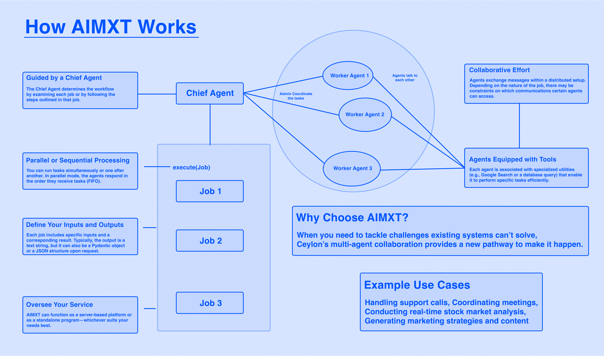

# AIMXT: A Multi-Agent System (MAS)

> Simplifying Complexity, Enhancing Collaboration

 

## Introduction

Welcome to AIMXT: A cutting-edge Multi-Agent System (MAS) purpose-built to streamline and orchestrate complex task flows among a network of specialized AI agents. AIMXT is designed to manage and automate the interactions between these agents, each assigned distinct roles and responsibilities, enabling seamless collaboration and the creation of powerful AI-driven solutions. By fostering cooperation and reducing complexity, AIMXT unlocks innovative possibilities for task automation and advanced problem-solving in the realm of artificial intelligence.

