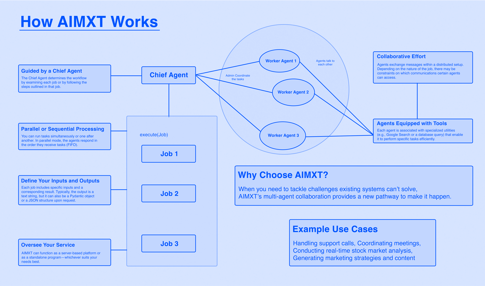

# AIMXT: A Multi-Agent System (MAS)

> Empowering Collaboration, Simplifying Complexity

## Introduction

Welcome to AIMXT: A Multi-Agent System (MAS) designed to orchestrate complex task flows among multiple AI agents.
AIMXT manages and automates interactions between agents, each with specific roles and responsibilities, enabling
powerful collaborative AI solutions. By empowering collaboration and simplifying complexity, AIMXT opens up new
possibilities in AI-driven task automation and problem-solving.

